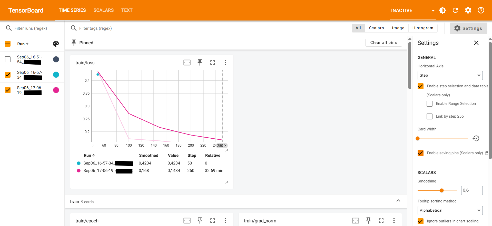

# NameForge – AI-Powered Domain Name Generator
<a href="https://creativecommons.org/licenses/by-nc-nd/4.0/">
  
</a>

NameForge is a project that leverages Large Language Models (LLMs) to generate creative, relevant, and safe domain name suggestions from business descriptions. The project emphasizes **dataset creation, model fine-tuning, evaluation, edge case discovery, and iterative improvement**.

The project report can be found as `NameForge.ipynb` and `NameForge.html`.
- - -

## API Example

### underground techno venue Berlin Mitte
```cmd
curl -X POST "https://llm.koenix.de/domain-generator/generate"      -H "Content-Type: application/json"      -d '{"business_description": "underground techno venue Berlin Mitte"}'
```

```json
{"suggestions":[
  {"domain":"undergroundtechno.com","confidence":1.0},
  {"domain":"berlinclub.net","confidence":0.93},
  {"domain":"techno-party.org","confidence":0.86}],
  "status":"success","message":null}
```

> **Note:** Confidence values are currently dummies. Real confidence would require training a statistical model or inspecting the LLM. This is left for future development.

### Berlin-based techno music festival and event space for electronic music lovers
```cmd
curl -X POST "https://llm.koenix.de/domain-generator/generate"      -H "Content-Type: application/json"      -d '{"business_description": "Berlin-based techno music festival and event space for electronic music lovers"}'
```

```json
{"suggestions":[
  {"domain":"berlinfestival.com","confidence":1.0},
  {"domain":"technoevents.net","confidence":0.93},
  {"domain":"electronicmusichub.org","confidence":0.86}],
  "status":"success","message":null}

```


### Blocked Request Example: Sex and erotic club in Berlin
```cmd
curl -X POST "https://llm.koenix.de/domain-generator/generate"      -H "Content-Type: application/json"      -d '{"business_description": "Sex and erotic club in Berlin"}'
```


**Response:**

```json
{
  "suggestions": [],
  "status": "blocked",
  "message": "Request contains inappropriate content"
}
```

- - -

## Project Structure
```
./                              # Root folder
    app/                        # API code and entrypoints
    artifacts/                  # Model files, tokenizer, templates
    data/                       # Datasets and data generation scripts
        llm-as-a-judge-training/ # Sample datasets for LLM evaluation
        raw/                     # Raw train/test CSV datasets
    hooks/                      # Pre-commit hooks
    img/                        # Images for documentation or notebooks
    outputs/                    # Evaluation outputs
        judged/                  # Judged results and summary CSVs
    prompts/                    # YAML prompts for generation/evaluation
    src/                        # Source code
        eval/                    # Evaluation scripts & Dockerfile
        fine_tune/               # Fine-tuning scripts and data utilities
        lib/                     # LLM wrapper
```
- - -

## Setup Instructions

This project has multiple environments depending on the phase of the workflow. Choose the appropriate environment based on your task.  

### 1. Clone the Repository

```bash
git clone https://github.com/ferdinand-koenig/name-forge.git  
cd name-forge
```

### 2. Environment Setup by Task

| Task | Recommended Tool | Notes |
|------|-----------------|-------|
| **Data Generation** | Pipenv | Used for GPU-based tasks and synthetic dataset creation. |
| **Fine-tuning** | Pipenv | Handles GPU-heavy model fine-tuning workflows. |
| **Evaluation / LLM-as-a-Judge** | Pipenv (scripts), Docker (test result generation) | Analysis uses Pipenv; Docker container available in `src/eval/Dockerfile` for generating outputs. |
| **Deployment / Inference** | Docker (CPU, Poetry used internally) | Docker container available at project root `Dockerfile`. |


### 3. Using Pipenv (GPU Tasks / Evaluation Scripts)

```bash
# Install Pipenv if not installed
pip install pipenv

# Activate environment
pipenv shell

# Install dependencies
pipenv install
```

### 4. Using Docker
> **For Unix users:** Replace line break ` with \

- **Evaluation / Test Generation Image:** `eval-name-forge`

```bash
docker run -it --rm `
  -v C:/Users/koenig/PycharmProjects/NameForge/artifacts:/insight-bridge/artifacts `
  -v C:/Users/koenig/PycharmProjects/NameForge/outputs:/insight-bridge/outputs `
  eval-name-forge
```

- **Inference / Deployment Image:** `server-name-forge`

```bash
docker run -it --rm `
  -v C:/Users/koenig/PycharmProjects/NameForge/artifacts:/insight-bridge/artifacts `
  -v pip_cache:/root/.cache/pip `
  -v C:/Users/koenig/PycharmProjects/NameForge/artifacts.zip:/insight-bridge/artifacts.zip
  -p 8000:8000 `
  server-name-forge
```

[//]: # (## Project Workflow)

[//]: # ()
[//]: # (1.  **Synthetic Dataset Creation**)

[//]: # (    *   Generate diverse business descriptions and corresponding domain names.)

[//]: # (    *   Preprocess and save datasets in `data/`.)

[//]: # (2.  **Model Training**)

[//]: # (    *   Fine-tune a baseline open-source LLM &#40;LoRA or full fine-tuning&#41;.)

[//]: # (    *   Save checkpoints in `checkpoints/`.)

[//]: # (3.  **Evaluation Framework**)

[//]: # (    *   LLM-as-a-judge scoring for relevance, creativity, and safety.)

[//]: # (    *   Store metrics in `experiments/`.)

[//]: # (4.  **Edge Case Discovery & Iterative Improvement**)

[//]: # (    *   Identify failure modes and retrain to improve performance.)

[//]: # (    *   Save improved model checkpoints and updated evaluation metrics.)

[//]: # (5.  **Safety Guardrails**)

[//]: # (    *   Ensure inappropriate or harmful content is blocked.)

[//]: # (6.  **FastAPI Server &#40;Optional&#41;**)

[//]: # (    *   Launch API endpoint in `server/app.py` for production-like usage.)

- - -


## Reproducibility

*   All experiments are reproducible via Pipenv.
*   Datasets, and evaluation results are versioned in the repo.

---

## Downloading the models
The models are too big for Github (Size of ~4GB per quantized model). To download them, visit
[https://llm.koenix.de/domain-generator/download](https://llm.koenix.de/domain-generator/download)


---
## Development
See also the `developer_guide.md` for tips on fine-tuning.

### The Wizard: Installing the Git Hook


1. **Install Pipenv (if not already installed):**

```bash
pip install --upgrade pip
pip install pipenv
```

2. **Install the project dependencies including dev packages:**

```bash
pipenv install --dev
```

3. **Install the pre-commit hook:**

```bash
pipenv run pre-commit install
```

This sets up the Git hooks defined in `.pre-commit-config.yaml`, so that checks like `black`, `isort`, and `flake8` run automatically before each commit.  

4. **Optionally, run hooks on all files manually:**

```bash
pipenv run pre-commit run --all-files
```


This ensures consistent code style and avoids commit errors.

[//]: # (![img/wizard.png]&#40;img/wizard.png&#41;)


### Tensorboard
You can monitor the LoRA fine-tuning in real-time using TensorBoard. The Hugging Face Trainer logs metrics to `./lora-mistral-domain`.


1. Activate your virtual environment:

```bash
source .venv/bin/activate   # Linux / Mac
# OR
.venv\Scripts\activate      # Windows PowerShell
```

2. Launch TensorBoard:

```bash
tensorboard --logdir ./lora-mistral-domain --port 6006
```

Open your browser and navigate to:

http://localhost:6006

You will see training and evaluation loss curves updating live. Press CTRL+C to stop TensorBoard.


### Developer Guide
Fine tuning was done on a remote machine via ssh access. Conversion to GGUF and quantization requires separate steps.
See also the `developer_guide.md` for tips on fine-tuning.
